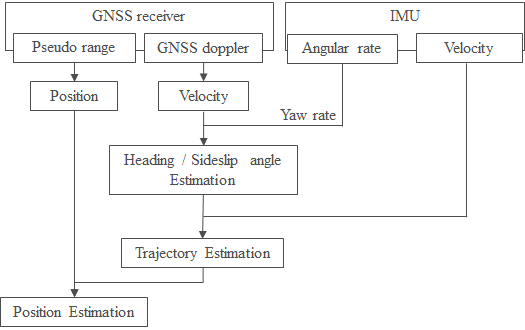

[Demo Video](https://youtu.be/u8Nan38BkDw)

## What is Eagleye

Eagleye is an open-source software for vehicle localization utilizing GNSS and IMU[[1]](https://www.researchgate.net/publication/329619280_Low-cost_Lane-level_Positioning_in_Urban_Area_Using_Optimized_Long_Time_Series_GNSS_and_IMU_Data). Eagleye provides highly accurate and stable vehicle position and orientation by using GNSS Doppler[[2]](https://www.jstage.jst.go.jp/article/jsaeronbun/44/1/44_20134048/_article/-char/en)[[3]](https://www.jstage.jst.go.jp/article/jsaeijae/3/2/3_20124032/_article/-char/ja)[[4]](https://ieeexplore.ieee.org/document/6236946)[[5]](https://www.researchgate.net/publication/290751834_Automotive_positioning_based_on_bundle_adjustment_of_GPS_raw_data_and_vehicle_trajectory)[[6]](https://ci.nii.ac.jp/naid/10029931657/). The flowchart of the algorithm is shown in the figure below. The algorithms in this software are based on the outcome of the research undertaken by [Machinery Information Systems Lab (Meguro Lab)](https://www2.meijo-u.ac.jp/~meguro/index.html) in Meijo University.

## Recommended Sensors
**GNSS receiver**

* [Ublox ZED-F9P](https://www.u-blox.com/en/product/zed-f9p-module) / [C099-F9P](https://www.u-blox.com/en/product/c099-f9p-application-board)
* [Septentrio Mosaic development kit with GNSS antenna](https://shop.septentrio.com/en/shop/mosaic-x5-devkit) 

**GNSS Antenna**

* [Ublox ANN-MB Series](https://www.u-blox.com/en/product/ann-mb-series)
* [Tallysman TW2710](http://www.tallysman.com/index.php/gnss/products/antennas-gpsbeidougalileoglonass/tw2710/)

**IMU**
* [Tamagawa Seiki TAG300 Series](http://mems.tamagawa-seiki.com/en/product/)
* [ANALOG DEVICES ADIS16475](https://www.analog.com/products/adis16475.html#product-overview)

**Wheel speed sensor**

* Eagleye uses vehicle speed acquired from CAN bus.

## How to install

### RTKLIB

Clone and Build MapIV's fork of [RTKLIB](https://github.com/MapIV/RTKLIB/tree/rtklib_ros_bridge). You can find more details about RTKLIB [here](http://www.rtklib.com/).

	sudo apt-get install gfortran
	cd $HOME
	git clone -b rtklib_ros_bridge_b34 https://github.com/MapIV/RTKLIB.git
	cd $HOME/RTKLIB/lib/iers/gcc/
	make
	cd $HOME/RTKLIB/app/consapp
	make 

### ROS Packages

Clone and build the necessary packages for Eagleye. 

	cd $HOME/catkin_ws/src
	git clone --recursive https://github.com/MapIV/eagleye.git
	git clone https://github.com/MapIV/rtklib_ros_bridge.git
	git clone https://github.com/MapIV/nmea_comms.git
	git clone https://github.com/MapIV/nmea_ros_bridge.git
	git clone https://github.com/MapIV/gnss_compass_ros.git
	sudo apt-get install -y libgeographic-dev geographiclib-tools geographiclib-doc
	sudo geographiclib-get-geoids best
	sudo mkdir /usr/share/GSIGEO
	sudo cp eagleye/eagleye_util/llh_converter/data/gsigeo2011_ver2_1.asc /usr/share/GSIGEO/
	cd ..
	rosdep install --from-paths src --ignore-src -r -y
	catkin_make -DCMAKE_BUILD_TYPE=Release

## Configuration

### GNSS

[ublox f9p settings](docs/gnss/f9p.md)

[septentrio mosaic settings](docs/gnss/mosaic.md)

### IMU

1. IMU settings.

* Output rate 50Hz

2. Check the rotation direction of z axis of IMU being used. If you look from the top of the vehicle, if the left turn is positive, set `pitch` to `3.14159` in `eagleye/eagleye_util/tf/config/sensors_tf.yaml`.

		 pitch: 3.14159

## Start each sensor driver

1. Check if wheel speed (vehicle speed) is published in `/can_twist` topic.

* Topic name: /can_twist
* Message type: geometry_msgs/TwistStamped twist.liner.x

2. Check if the IMU data is published in `/imu/data_raw` topic.

3. Start RTKLIB.

	ex. single point positioning

		cd $HOME/RTKLIB
		bash rtklib_ros_bridge_single.sh

	ex. Real Time Kinematic
 
 		cd $HOME/RTKLIB
		bash rtklib_ros_bridge_meijo_rtk.sh

4. Check if RTKLIB is working by execute the following command in the terminal. If the RTKLIB is working correctly, positioning information is appeared continuously in the terminal.

		status 0.1  

5. Start rtklib_ros_bridge.

		roslaunch rtklib_bridge rtklib_bridge.launch   

6. Start nmea_comms in f9p or nmea_ros_bridge in mosaic.

		roslaunch nmea_comms f9p_nmea_sentence.launch

   or

		roslaunch nmea_ros_bridge nmea_udp.launch

## eagleye_rt

- [eagleye_rt](eagleye_rt) : real-time version

## eagleye_pp

- [eagleye_pp](eagleye_pp) : post-processing version

## Optional Features

### canless mode

While normal eagleye requires CAN (wheel speed) information, this option allows localization estimation with GNSS/IMU alone, without vehicle speed.

However, in this mode, note the following
- Accuracy degrades in non-open sky environments.
- RTK positioning is required.
- Localization estimating is not possible when driving backward.

To use this mode
- Use launch/eagleye_rt_canless.launch for eagleye_rt instead of launch/eagleye_rt.launch.
- Set use_canless_mode in eagleye_pp_config.yaml to true for eagleye_pp.

### dual antenna mode

This option allows for more immediate heading estimatiion, and allows GNSS to estimate heading even at low speeds.
eagleye_pp not yet supported.

To use this mode
- Use launch/eagleye_rt_dualantenna.launch for eagleye_rt instead of launch/eagleye_rt.launch.

## Sample data
### ROSBAG

| No. | Date | Place | Sensors | Link |
|-----|------|-------|---------| ---- |
|1|2020/01/27|Moriyama, Nagoya [route](https://www.google.com/maps/d/edit?mid=1pK4BgrGtoo14nguArDf-rZDqIL5Cg-v5&usp=sharing)|GNSS: Ublox F9P IMU: Tamagawa AU7684 LiDAR: Velodyne HDL-32E|[Download](https://www.dropbox.com/s/pfs307qn7gfeou5/eagleye_sample_20200127.bag?dl=0)|
|2|2020/07/15|Moriyama, Nagoya [route](https://www.google.com/maps/d/edit?mid=1DnXfZBTSsHpWlzTAcENmFxo17r3PxGxM&usp=sharing)|GNSS: Ublox F9P with RTK IMU: Tamagawa AU7684 LiDAR: Velodyne VLP-32C|[Download](https://www.dropbox.com/s/w9ag6gs17bi80st/eagleye_sample_20200715.bag?dl=0)

### Maps
The 3D maps (point cloud and vector data) of the route is also available from [Autoware sample data](https://drive.google.com/file/d/1Uwp9vwvcZwaoZi4kdjJaY55-LEXIzSxf/view).

## Research Papers for Citation

1. A. Takanose, et., al., "Eagleye: A Lane-Level Localization Using Low-Cost GNSS/IMU", Intelligent Vehicles (IV) workshop, 2021 [Link](https://www.autoware.org/iv2021video-workshoppapers3)

1. J Meguro, T Arakawa, S Mizutani, A Takanose, "Low-cost Lane-level Positioning in Urban Area Using Optimized Long Time Series GNSS and IMU Data", International Conference on Intelligent Transportation Systems(ITSC), 2018 [Link](https://www.researchgate.net/publication/329619280_Low-cost_Lane-level_Positioning_in_Urban_Area_Using_Optimized_Long_Time_Series_GNSS_and_IMU_Data)

1. Takeyama Kojiro, Kojima Yoshiko, Meguro Jun-ichi, Iwase Tatsuya, Teramoto Eiji, "Trajectory Estimation Based on Tightly Coupled Integration of GPS Doppler and INS" -Improvement of Trajectory Estimation in Urban Area-, Transactions of Society of Automotive Engineers of Japan   44(1) 199-204, 2013 [Link](https://www.jstage.jst.go.jp/article/jsaeronbun/44/1/44_20134048/_article/-char/en)

1. Junichi Meguro, Yoshiko Kojima, Noriyoshi Suzuki, Teramoto Eiji, "Positioning Technique Based on Vehicle Trajectory Using GPS Raw Data and Low-cost IMU", International Journal of Automotive Engineering 3(2) 75-80,  2012 [Link](https://www.jstage.jst.go.jp/article/jsaeijae/3/2/3_20124032/_article/-char/ja)

1. K Takeyama, Y Kojima, E Teramoto, "Trajectory estimation improvement based on time-series constraint of GPS Doppler and INS in urban areas", IEEE/ION Position, Location and Navigation Symposium(PLANS), 2012 [Link](https://ieeexplore.ieee.org/document/6236946)

1. Junichi Meguro, Yoshiko Kojima, Noriyoshi Suzuki, Eiji Teramoto, "Automotive Positioning Based on Bundle Adjustment of GPS Raw Data and Vehicle Trajectory", International Technical Meeting of the Satellite Division of the Institute of Navigation (ION), 2011 [Link](https://www.researchgate.net/publication/290751834_Automotive_positioning_based_on_bundle_adjustment_of_GPS_raw_data_and_vehicle_trajectory)

1. Yoshiko Kojima, et., al., "Precise Localization using Tightly Coupled Integration based on Trajectory estimated from GPS Doppler", International Symposium on Advanced Vehicle Control(AVEC), 2010 [Link](https://ci.nii.ac.jp/naid/10029931657/)

## License
Eagleye is provided under the [BSD 3-Clause](https://github.com/MapIV/eagleye/blob/master/LICENSE) License.

## Contacts

If you have further question, email to support@map4.jp.
