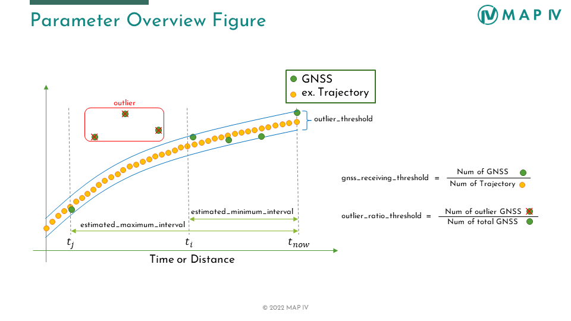

# Parameter description

The parameters for estimation in Eagleye can be set in the `config/eagleye_config.yaml` file.

## Estimate mode

| Name                                | Type   | Description                                                                     | Default value        |
| :---------------------------------- | :----- | :------------------------------------------------------------------------------ | :------------------- |
| use_gnss_mode                       | string | Selecting the GNSS message type to use (RTKLIB/rtklib or NMEA/nmea)             | RTKLIB               |
| use_canless_mode                    | bool   | Speed estimation as an alternative to speed sensors                             | false                |

## Topic

| Name                          | Type   | Description                                                             | Default value            |
| :---------------------------- | :----- | :---------------------------------------------------------------------- | :----------------------- |
| imu_topic                     | string | Topic name to be subscribed to in node (sensor_msgs/Imu.msg)            | /imu/data_raw            |
| twist.twist_type                   | int | Topic type to be subscribed to in node (TwistStamped : 0, TwistWithCovarianceStamped: 1) | 0               |
| twist.twist_topic                   | string | Topic name to be subscribed to in node | /can_twist               |
| gnss.velocity_source_type              | int | Topic type to be subscribed to in node (rtklib_msgs/RtklibNav: 0, nmea_msgs/Sentence: 1, ublox_msgs/NavPVT: 2, geometry_msgs/TwistWithCovarianceStamped: 3)      | 0        |
| gnss.velocity_source_topic              | string | Topic name to be subscribed to in node      | /rtklib_nav        |
| gnss.llh_source_type              | int | Topic type to be subscribed to in node (rtklib_msgs/RtklibNav: 0, nmea_msgs/Sentence: 1, sensor_msgs/NavSatFix: 2)      | 0        |
| gnss.llh_source_topic              | string | Topic name to be subscribed to in node   | /rtklib_nav        |

## TF

| Name                                | Type   | Description                                                                     | Default value        |
| :---------------------------------- | :----- | :------------------------------------------------------------------------------ | :------------------- |
| _tf_gnss_frame_                     |        |                                                                                 |                      |
| parent                              | string |                                                                                 | base_link            |
| child                               | string |                                                                                 | gnss                 |

## Origin of GNSS coordinates (ECEF to ENU)

| Name                                | Type   | Description                                                                     | Default value        |
| :---------------------------------- | :----- | :------------------------------------------------------------------------------ | :------------------- |
| _ecef_base_pos_                     |        |                                                                                 |                      |
| x                                   | double | x-coordinate                                                                    | 0                    |
| y                                   | double | y-coordinate                                                                    | 0                    |
| z                                   | double | z-coordinate                                                                    | 0                    |
| use_ecef_base_position              | bool   | Flag to use arbitrary origin coordinates                                        | false                |

## Common Parameters

| Name                                | Type   | Description                                                                     | Default value        |
| :---------------------------------- | :----- | :------------------------------------------------------------------------------ | :------------------- |
| imu_rate                            | double | IMU sampling cycle [Hz]                                                         | 50                   |
| gnss_rate                           | double | GNSS sampling cycle [Hz]                                                        | 5                    |
| stop_judgment_threshold             | double | Stop judgment velocity [m/s]                                                    | 0.01                 |
| slow_judgment_threshold             | double | Slow judgment velocity [m/s]                                                    | 0.278 (1km/s)        |
| moving_judgment_threshold           | double | Movement judgment velocity [m/s]                                                | 2.78 (10km/s)        |

## Eagleye Navigation Parameters

### Basic Description

The following parameters are used in most estimations.
Figure shows the relationship between these parameters.

* _estimated_minimum_interval/estimated_maximum_interval_  
* _gnss_receiving_threshold_  
* _outlier_threshold_  
* _outlier_ratio_threshold_  

### Basic Navigation Functions
### velocity_scale_factor

| Name                                | Type   | Description                                                                     | Default value       |
| :---------------------------------- | :----- | :------------------------------------------------------------------------------ | :------------------ |
| estimated_minimum_interval          | double | Minimum time of data buffering for estimation [s]                               | 20                  |
| estimated_maximum_interval          | double | Maximum time of data buffering for estimation [s]                               | 400                 |
| gnss_receiving_threshold            | double | Threshold of minimum GNSS reception rate (Value from 0~1)                       | 0.25                |
| velocity_scale_factor_save_str      | double | Scale factor value storage destination                                          | /config/velocity_scale_factor.txt |
| save_velocity_scale_factor          | bool   | Flag to select preservation of estimated scale factor                           | false               |
| velocity_scale_factor_save_duration | double | Scale factor save timing [s]                                                    | 100                 |

### yawrate_offset_stop

| Name                                | Type   | Description                                                                     | Default value        |
| :---------------------------------- | :----- | :-------------------------------------------------------------------------      | :------------------- |
| estimated_interval                  | double | Time of data buffering for estimation [s]                                       | 4                    |
| outlier_threshold                   | double | Allowable gap between current outlier estimate and previous estimate [rad]      | 0.002                |

### yawrate_offset

| Name                                | Type   | Description                                                                     | Default value        |
| :---------------------------------- | :----- | :------------------------------------------------------------------------------ | :------------------- |
| estimated_minimum_interval          | double | Minimum time of data buffering for estimation [s]                               | 30                   |
| estimated_maximum_interval          | double | Maximum time of data buffering for estimation [s]                               | 300 (1st), 500 (2nd) |
| gnss_receiving_threshold            | double | Threshold of minimum GNSS reception rate (Value from 0~1)                       | 0.25                 |
| outlier_threshold                   | double | Allowable gap between current estimate and _yawrate_offset_stop_ estimate [rad] | 0.002                |

### heading

| Name                                | Type   | Description                                                                     | Default value        |
| :---------------------------------- | :----- | :------------------------------------------------------------------------------ | :------------------- |
| estimated_minimum_interval          | double | Minimum time of data buffering for estimation [s]                               | 10                   |
| estimated_maximum_interval          | double | Maximum time of data buffering for estimation [s]                               | 30                   |
| gnss_receiving_threshold            | double | Threshold of minimum GNSS reception rate (Value from 0~1)                       | 0.25                 |
| outlier_threshold                   | double | Outlier threshold due to GNSS multipath [rad]                                   | 0.0524 (3 deg)       |
| outlier_ratio_threshold             | double | Ratio of allowable outliers in the interval (Value from 0~1)                    | 0.5                  |
| curve_judgment_threshold            | double | Yaw rate threshold for curve determination [rad/s]                              | 0.0873 (5 deg/s)     |
| init_STD                   | double | Standard deviation of Doppler azimuth angle [rad] | 0.0035 (0.2 deg)          |

### heading_interpolate

| Name                                | Type   | Description                                                                     | Default value        |
| :---------------------------------- | :----- | :------------------------------------------------------------------------------ | :------------------- |
| sync_search_period                  | double | Synchronous search time for delay interpolation [s]                             | 2                    |
| proc_noise                   | double | Process Noise [rad] | 0.0005 (0.03 deg)          |

### slip_angle

| Name                                | Type   | Description                                                                     | Default value        |
| :---------------------------------- | :----- | :------------------------------------------------------------------------------ | :------------------- |
| manual_coefficient                  | double | Coefficients for slip angle estimation                                          | 0.0                  |

### slip_coefficient

| Name                                | Type   | Description                                                                     | Default value        |
| :---------------------------------- | :----- | :------------------------------------------------------------------------------ | :------------------- |
| estimated_minimum_interval          | double | Minimum time of data buffering for estimation [s]                               | 2                    |
| estimated_maximum_interval          | double | Maximum time of data buffering for estimation [s]                               | 100                  |
| curve_judgment_threshold            | double | Yaw rate threshold for curve determination [rad/s]                              | 0.0174 (1 deg/s)     |
| lever_arm                           | double | Distance from GNSS antenna to center of rear axle [m]                           | 0.0                  |

### rolling
| Name                                | Type   | Description                                                                     | Default value        |
| :---------------------------------- | :----- | :------------------------------------------------------------------------------ | :------------------- |
| filter_process_noise                | double | Process noise for LPF [$(m/s^2)^2$]                                             | 0.01                 |
| filter_observation_noise            | double | Observation noise for LPF [$(m/s^2)^2$]                                         | 1                    |

### trajectory

| Name                                | Type   | Description                                                                     | Default value        |
| :---------------------------------- | :----- | :------------------------------------------------------------------------------ | :------------------- |
| curve_judgment_threshold            | double | Yaw rate threshold for curve determination [rad/s]                              | 0.0174 (1 deg/s)     |
| timer_updata_rate                   | double | Self-diagnostic cycle [Hz]                                                      | 10                   |
| deadlock_threshold                  | double | Allowable communication deadlock time for error output [s]                      | 1                    |
| sensor_noise_velocity                  | double | Sensor velocity noise                             | 0.05                    |
| sensor_scale_noise_velocity                  | double | Sensor velocity scale noise                             | 0.02                    |
| sensor_noise_yawrate                  | double | Sensor yaw rate noise                             | 0.01                    |
| sensor_bias_noise_yawrate                  | double | Sensor yaw rate bias noise                             | 0.01                    |

### smoothing

| Name                                | Type   | Description                                                                     | Default value        |
| :---------------------------------- | :----- | :------------------------------------------------------------------------------ | :------------------- |
| moving_average_time                 | double | Moving average time of GNSS positioning solution [s]                            | 3                    |
| moving_ratio_threshold              | double | Ratio of movement within the interval (Value from 0~1)                          | 0.1                  |

### height

| Name                                | Type   | Description                                                                     | Default value        |
| :---------------------------------- | :----- | :------------------------------------------------------------------------------ | :------------------- |
| estimated_minimum_interval          | double | Minimum distance of data buffering for estimation [m]                           | 200                  |
| estimated_maximum_interval          | double | Maximum distance of data buffering for estimation [m]                           | 2000                 |
| update_distance                     | double | Distance of minimum movement to update the RTK-FIX solution [m]                 | 0.1                  |
| gnss_receiving_threshold            | double | Threshold of minimum GNSS reception rate (Value from 0~1)                       | 0.1                  |
| outlier_threshold                   | double | Outlier threshold due to GNSS multipath [m]                                     | 0.3                  |
| outlier_ratio_threshold             | double | Ratio of allowable outliers in the interval (Value from 0~1)                    | 0.5                  |
| moving_average_time                 | double | Moving average time of longitudinal acceleration [s]                            | 1                    |

### position

| Name                                | Type   | Description                                                                     | Default value        |
| :---------------------------------- | :----- | :------------------------------------------------------------------------------ | :------------------- |
| estimated_interval                  | double | Distance of data buffering for estimation [m]                                   | 300                  |
| update_distance                     | double | Distance of minimum movement to update data buffer [m]                          | 0.1                  |
| gnss_receiving_threshold            | double | Threshold of minimum GNSS reception rate (Value from 0~1)                       | 0.25                 |
| outlier_threshold                   | double | Outlier threshold due to GNSS multipath [m]                                     | 3                    |
| outlier_ratio_threshold             | double | Ratio of allowable outliers in the interval (Value from 0~1)                    | 0.5                  |

### position_interpolate

| Name                                | Type   | Description                                                                     | Default value        |
| :---------------------------------- | :----- | :------------------------------------------------------------------------------ | :------------------- |
| sync_search_period                  | double | Synchronous search time for delay interpolation [s]                             | 2                    |

### monitor

| Name                                | Type   | Description                                                                     | Default value        |
| :---------------------------------- | :----- | :------------------------------------------------------------------------------ | :------------------- |
| print_status                        | bool   | Flag to output Eagleye estimates to console                                     | true                 |
| log_output_status                   | bool   | Flag to output Eagleye estimates to `log/eagleye_log_DATE.csv`                  | false                |
| update_rate                         | double | Update cycle of Eagleye estimates [hz]                                          | 10                   |
| th_gnss_deadrock_time               | double | Allowable communication deadlock time for error output [s]                      | 10                   |
| th_velocity_scale_factor_ratio      | double | Allowable ratio between current outlier estimate and previous estimate          | 0.01                 |
| use_compare_yawrate                 | bool   | Flag for yaw rate value comparison diagnostics                                  | false                |
| comparison_twist_topic              | string | Topic name for comparison (geometry_msgs/TwistStamped.msg)                      | /calculated_twist    |
| th_diff_rad_per_sec                 | double | Allowable difference from comparables for error output [rad/s]                  | 0.174 (10 deg/s)     |
| th_num_continuous_abnormal_yawrate  | double | Number of times an abnormal value occurs for error output                       | 25                   |
| th_dr_distance                      | double | Threshold for dead reckoning distance to error output [m]                       | 50                   |

### Optional Navigation Functions
### angular_velocity_offset_stop

| Name                                | Type   | Description                                                                | Default value |
| :---------------------------------- | :----- | :------------------------------------------------------------------------- | :------------ |
| estimated_interval                  | double | Time of data buffering for estimation [s]                                  | 4             |
| outlier_threshold                   | double | Allowable gap between current outlier estimate and previous estimate [rad] | 0.002         |

### rtk_deadreckoning

| Name                                | Type   | Description                                                                     | Default value        |
| :---------------------------------- | :----- | :------------------------------------------------------------------------------ | :------------------- |
| rtk_fix_STD                     | double | RTK-FIX position covariance
 [m]                 | 0.3                  |
| proc_noise          | double | Process Noise
 [m]                               | 0.05                   |

### rtk_heading

| Name                                | Type   | Description                                                                     | Default value        |
| :---------------------------------- | :----- | :------------------------------------------------------------------------------ | :------------------- |
| update_distance                     | double | Distance of minimum movement to update the RTK-FIX solution [m]                 | 0.3                  |
| estimated_minimum_interval          | double | Minimum time of data buffering for estimation [s]                               | 10                   |
| estimated_maximum_interval          | double | Maximum time of data buffering for estimation [s]                               | 30                   |
| gnss_receiving_threshold            | double | Threshold of minimum GNSS reception rate (Value from 0~1)                       | 0.25                 |
| outlier_threshold                   | double | Outlier threshold due to GNSS multipath [rad]                                   | 0.0524 (3 deg)       |
| outlier_ratio_threshold             | double | Ratio of allowable outliers in the interval (Value from 0~1)                    | 0.5                  |
| curve_judgment_threshold            | double | Yaw rate threshold for curve determination [rad/s]                              | 0.0873 (5 deg/s)     |

### enable_additional_rolling

| Name                                | Type   | Description                                                                     | Default value        |
| :---------------------------------- | :----- | :------------------------------------------------------------------------------ | :------------------- |
| update_distance                     | double | Distance of minimum movement to update pose [m]                                 | 0.3                  |
| moving_average_time                 | double | Moving average time of lateral acceleration [s]                                 | 1                    |
| sync_judgment_threshold             | double | Synchronization judgment threshold [s]                                          | 0.01                 |
| sync_search_period                  | double | Synchronous search time for delay interpolation [s]                             | 1                    |

### velocity_estimator

| Name                                | Type   | Description                                                                     | Default value        |
| :---------------------------------- | :----- | :------------------------------------------------------------------------------ | :------------------- |
| gga_downsample_time                 | double | Minimum time to update NMEA GGA [s]                                             | 0.5                  |
| stop_judgment_velocity_threshold    | double | Stop judgment velocity [m/s]                                                    | 0.2                  |
| stop_judgment_interval              | double | Time to stop judgment [s]                                                       | 1                    |
| variance_threshold                  | double | Angular velocity vibration variance for stop judgment [$(rad/s)^2$]             | 0.000025             |
|                                     |        |                                                                                 |                      |
| _pitchrate_offset_                  |        |                                                                                 |                      |
| estimated_interval                  | double | Time of data buffering for estimation [s]                                       | 8                    |
|                                     |        |                                                                                 |                      |
| _pitching_                          |        |                                                                                 |                      |
| estimated_interval                  | double | Time of data buffering for estimation [s]                                       | 5                    |
| outlier_threshold                   | double | Outlier threshold due to GNSS multipath [rad]                                   | 0.0174 (1 deg)       |
| gnss_receiving_threshold            | double | Threshold of minimum GNSS reception rate (Value from 0~1)                       | 0.2                  |
| outlier_ratio_threshold             | double | Ratio of allowable outliers in the interval (Value from 0~1)                    | 0.5                  |
|                                     |        |                                                                                 |                      |
| _acceleration_offset_               |        |                                                                                 |                      |
| estimated_minimum_interval          | double | Minimum time of data buffering for estimation [s]                               | 30                   |
| estimated_maximum_interval          | double | Maximum time of data buffering for estimation [s]                               | 500                  |
| filter_process_noise                | double | Process noise for LPF [$(m/s^2)^2$]                                             | 0.01                 |
| filter_observation_noise            | double | Observation noise for LPF [$(m/s^2)^2$]                                         | 1                    |
|                                     |        |                                                                                 |                      |
| _doppler_fusion_                    |        |                                                                                 |                      |
| estimated_interval                  | double | Time of data buffering for estimation [s]                                       | 4                    |
| gnss_receiving_threshold            | double | Threshold of minimum GNSS reception rate (Value from 0~1)                       | 0.2                  |
| outlier_threshold                   | double | Outlier threshold due to GNSS multipath [m/s]                                   | 0.1                  |
| outlier_ratio_threshold             | double | Ratio of allowable outliers in the interval (Value from 0~1)                    | 0.5                  |
